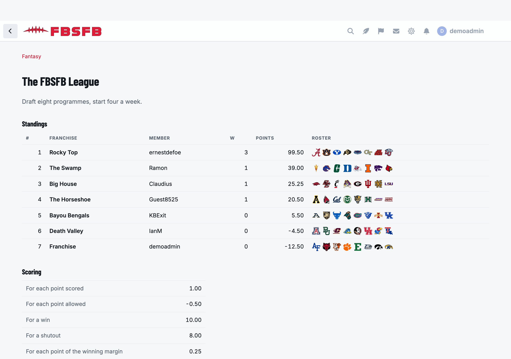

# Fantasy

A season-long fantasy league for [Flarum](https://flarum.org) 2, where members
draft **teams** rather than players.



Every result is read from the fixtures and scores
[Picks](https://github.com/ernestdefoe/picks) already syncs, so nothing here
needs a second data source or a second API key.

```sh
composer require ernestdefoe/fantasy
php flarum migrate
php flarum cache:clear
```

`fantasy:score` runs hourly on Flarum's scheduler.

## It plays whatever sport its season is

A league plays a **Picks season**, and a season belongs to a competition — so a
league plays college football, the NFL, the NBA, MLB, the NHL or league
football, whichever its season is.

Two things follow, and they are the whole of it:

**A draft only offers teams that actually play in the season.** `picks_teams`
holds six sports' teams, so "a team exists" is not the same question as "a team
is in this competition" — without the scope a college-football draft board
offers the Milwaukee Bucks, and the franchise that took one is a starter short
for the rest of the year with nothing on screen saying why. It is asked of the
**fixtures**, which is stricter than a label: a club with no games this season
is not draftable however it is filed.

**A league starts from its own sport's numbers.** The rules travel between
sports; the numbers do not.

| Sport | A game | Per point | Win | Shutout |
|---|---|---|---|---|
| Gridiron | ~31–17 | 1.00 | 10 | 8 |
| Basketball | ~112–104 | 0.25 | 10 | — |
| Baseball | ~5–3 | 4.00 | 10 | 12 |
| Ice hockey | ~3–2 | 6.00 | 10 | 15 |
| Football | ~2–1 | 12.00 | 15 | 10 |

They are calibrated so an ordinary win is worth roughly the same in any sport —
between 25 and 39 points for one starter — which makes two leagues on one forum
comparable and stops a basketball table reading like a phone number.

🚨 **A basketball shutout bonus is zero and the row is not drawn at all**,
because a basketball shutout cannot happen. A rule listed at 0.00 that can never
pay out reads as a broken rule rather than as an impossible event.

Everything stays editable; this only decides what a new league starts from, and
it never touches a league that already exists.

## Things worth knowing

🚨 **A game only scores once it is finished.** `picks_events` carries a live
score while a game is being played; scoring off that would move a franchise's
total up and down all afternoon and make a matchup "final" at half time. A game
with a NULL score has not been reported on, which is not 0–0.

🚨 **Scoring is idempotent.** Every pass upserts, so running it twice writes the
same rows and changes nothing — which is what makes it safe on a schedule beside
a live-score sync that will re-report a game that was already final.

🚨 **One owner per team is a UNIQUE INDEX**, not a rule the application
remembers. Two people clicking Add on the same free agent in the same second
both pass a "is it taken?" check; only one insert can win, and the loser is told
so rather than shown a stack trace.

🚨 **The workings are stored, not just the total.** Points scored, allowed, the
win, the shutout and the bonus are written beside the points — because a
commissioner fixing a broken rule in week three would otherwise make every
earlier week unexplainable.

## Requires

- Flarum 2
- [`ernestdefoe/picks`](https://github.com/ernestdefoe/picks) for the fixtures
  and results

## Licence

MIT.
